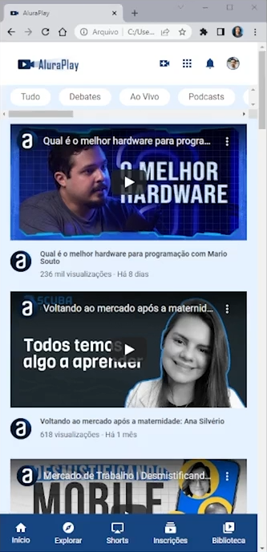
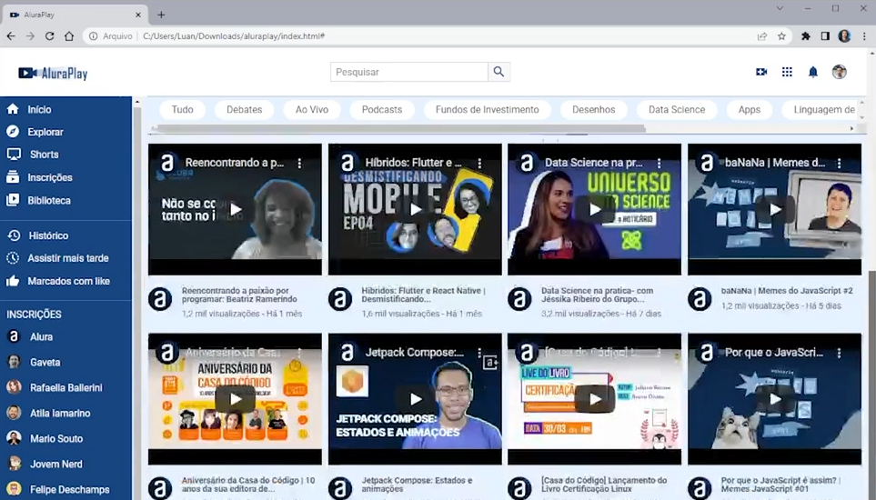

# AluraPlay

## Descrição
O AluraPlay é uma plataforma de vídeos com um layout moderno e rico em elementos. O projeto possui três telas principais para celulares, tablets e desktops, cada uma com seu próprio design e funcionalidades específicas.

### Tela para Celulares

- Cabeçalho com logo e ícones de navegação
- Seção de navegação com várias opções
- Seção de vídeos com dezesseis vídeos do canal da Alura
- Rodapé com tópicos relacionados à tecnologia e menu inferior

### Tela para Tablets

- Menu lateral esquerdo
- Cabeçalho com campo de pesquisa
- Vídeos organizados dois por linha
- Rodapé expandido com tópicos em quatro colunas

### Tela para Desktops

- Menu expandido com mais elementos
- Vídeos distribuídos quatro por linha
- Rodapé expandido com tópicos um ao lado do outro

## Tecnologias Utilizadas
- 
- 
- 

